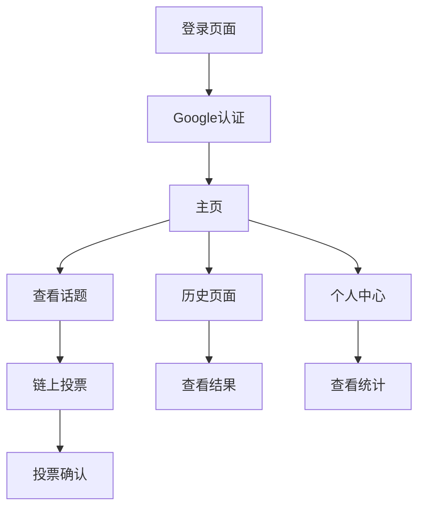

## 1. 产品概述

"Sui Minority Report"是一个基于Sui区块链的去中心化投票预测游戏。用户通过Google登录参与投票，系统每小时生成3个AI话题供用户预测，用户通过链上投票参与，结果从链上查询。

产品目标：创建一个透明、不可篡改的预测市场，让用户参与未来事件预测并获得准确性的声誉。

## 2. 核心功能

### 2.1 用户角色

| 角色    | 注册方式           | 核心权限             |
| ----- | -------------- | ---------------- |
| 普通用户  | Google OAuth登录 | 查看话题、参与投票、查看历史记录 |
| 系统管理员 | 预设账户           | 管理话题生成、查看系统统计    |

### 2.2 功能模块

核心页面包括：

1. **登录页面**：Google OAuth登录入口
2. **主页**：当前话题展示、投票功能、倒计时显示
3. **历史页面**：过往话题列表、投票结果、用户预测准确率
4. **个人中心**：用户统计、投票历史、个人资料

### 2.3 页面详情

| 页面名称 | 模块名称     | 功能描述                            |
| ---- | -------- | ------------------------------- |
| 登录页面 | Google登录 | 使用Supabase Auth进行Google OAuth认证 |
| 主页   | 当前话题     | 显示3个活跃话题，包含标题、描述、截止时间           |
| 主页   | 投票功能     | 对每个话题选择"是/否"进行链上投票              |
| 主页   | 倒计时器     | 显示距离下次话题生成的时间                   |
| 历史页面 | 过往话题列表   | 显示已结束的话题和最终结果                   |
| 历史页面 | 用户准确率    | 显示用户预测准确率统计                     |
| 个人中心 | 用户统计     | 显示总投票数、正确预测数、准确率                |
| 个人中心 | 投票历史     | 显示用户所有投票记录和结果                   |

## 3. 核心流程

用户操作流程：

1. 用户访问应用 → Google登录 → 进入主页
2. 主页查看当前话题 → 选择预测 → 链上投票 → 查看投票确认
3. 话题结束后 → 查看结果 → 更新用户准确率
4. 访问历史页面 → 查看过往话题和结果
5. 访问个人中心 → 查看个人统计和历史记录

## 4. 用户界面设计

### 4.1 设计风格

* 主色调：深蓝色(#1E3A8A) + 金色(#F59E0B) 体现科技感和预测主题

* 按钮样式：圆角矩形，悬停效果，链上操作按钮使用金色强调

* 字体：Inter字体族，标题24px，正文16px，小字14px

* 布局风格：卡片式布局，响应式网格系统

* 图标风格：使用Lucide React图标库，线性图标风格

### 4.2 页面设计概览

| 页面名称 | 模块名称 | UI元素                   |
| ---- | ---- | ---------------------- |
| 登录页面 | 登录按钮 | 居中Google登录按钮，白色背景，蓝色边框 |
| 主页   | 话题卡片 | 白色卡片，蓝色标题，灰色描述，金色投票按钮  |
| 主页   | 倒计时器 | 大字体数字显示，红色紧迫感          |
| 历史页面 | 结果列表 | 表格展示，正确预测绿色标记，错误红色标记   |
| 个人中心 | 统计卡片 | 圆形进度条显示准确率，数字大字体突出     |

### 4.3 响应式设计

桌面优先设计，适配移动端：

* 桌面端：三列网格展示话题

* 平板端：双列网格

* 手机端：单列垂直布局

* 触摸优化：按钮最小44px，适合手指点击

### 4.4 区块链交互指导

* 投票确认：使用Sui钱包连接，显示交易哈希

* 状态反馈：投票中显示加载动画，成功显示绿色确认

* Gas费用：预估并显示交易费用

* 错误处理：友好的错误提示和重试机制

